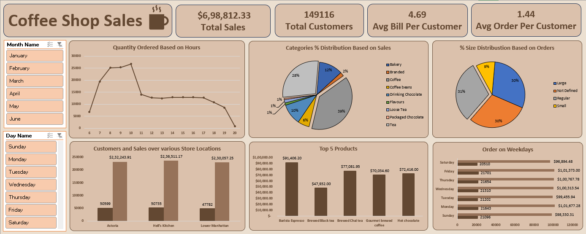

# ☕ Coffee_Shop_Sales_Analysis

## 📌 Overview
The **Coffee Shop Sales Analysis** project focuses on analyzing retail sales data of a coffee shop to derive actionable business insights.  
The objective of this project is to understand customer purchasing behavior, sales trends, product performance, and store-wise performance using an **interactive Excel dashboard**.

The analysis helps stakeholders make data-driven decisions related to inventory planning, staffing, pricing, and promotional strategies.

---

## 🎯 Business Problem
Coffee shops generate large volumes of transactional data every day, but raw data alone does not provide meaningful insights.  
The key business challenges addressed in this project are:

- Identifying peak sales hours and high-traffic days
- Understanding which products and categories drive the most revenue
- Comparing performance across different store locations
- Analyzing customer purchase patterns (average bill and order size)
- Supporting better operational and marketing decisions using data

---

## 📂 Dataset Overview
The **Coffee_Shop_Sale** dataset provides valuable information for analyzing and understanding sales performance for an entire year.

**Dataset Details:**
- Total Records: **150,000+ rows**
- Format: CSV (loaded and analyzed in Excel)

---

## 🛠 Tools & Technologies
- **Microsoft Excel**
  - Data Cleaning
  - Data Transformation
  - Pivot Tables
  - Charts & Visualizations
  - Interactive Dashboard

> No other tools or programming languages were used in this project.

---

## 🔍 Approach
1. **Dataset Source**
   - The dataset was sourced from **Kaggle** in CSV format.

2. **Data Loading**
   - Loaded the CSV file into Microsoft Excel.

3. **Requirement Analysis**
   - Understood business questions and dashboard requirements.
   - Identified key metrics and KPIs.

4. **Data Cleaning & Transformation**
   The following steps were performed to clean and prepare the data:

   - **Conditional Formatting** to create and highlight new calculated columns
   - **Replace Values** where required for accurate analysis
   - **Trim White Spaces** from text columns
   - **Created Custom Columns**
     - `Total_Bill = transaction_qty × unit_price`
   - **Delimiter Usage**
     - Transformed `transaction_time` to extract only time values

5. **Dashboard Creation**
   - Built interactive Excel dashboards using Pivot Tables and Charts
   - Added slicers for Month and Day filtering

---

## 📊 Key Insights
## 📸 Dashboard Preview

### ⏰ Sales by Hour
- Sales peak between **7 AM – 10 AM**, indicating strong morning demand.
- Orders decline steadily after evening hours.

**Insight:** Morning hours are critical for staffing and inventory planning.

---

### 🧾 Sales by Product Category
- **Coffee** contributes the highest share of total sales.
- Bakery and Drinking Chocolate follow.
- Tea and packaged items contribute minimally.

**Insight:** Coffee products are the primary revenue drivers.

---

### 📦 Order Size Distribution
- **Large** and **Regular** sizes dominate total orders.
- Small-size orders are least preferred.

**Insight:** Customers favor higher-value orders, creating upselling opportunities.

---

### 🏬 Store Location Performance
- **Hell’s Kitchen** leads in both sales and customer count.
- Astoria performs consistently.
- Lower Manhattan shows slightly lower sales.

**Insight:** Hell’s Kitchen is the best-performing store and a benchmark location.

---

### 🏆 Top Products
- **Barista Espresso** is the top-selling product by revenue.
- Brewed Chai Tea and Gourmet Brewed Coffee also perform strongly.

**Insight:** Best-selling products should be prioritized for promotions and stock.

---

### 📅 Sales by Day
- **Friday and Saturday** record the highest sales.
- Sunday has comparatively lower sales.

**Insight:** Weekends are peak business periods requiring higher operational focus.

---

## ✅ Final Conclusion
This Coffee Shop Sales Analysis successfully transforms raw transactional data into meaningful business insights using Excel.  
The dashboard highlights peak sales hours, best-performing products, customer preferences, and store-wise performance.

**Key Takeaways:**
- Morning hours drive maximum sales
- Coffee products dominate revenue
- Large and regular order sizes are most popular
- Hell’s Kitchen is the top-performing store
- Weekends generate higher sales volumes

These insights can help improve operational efficiency, boost revenue, and support strategic decision-making for the coffee shop.
